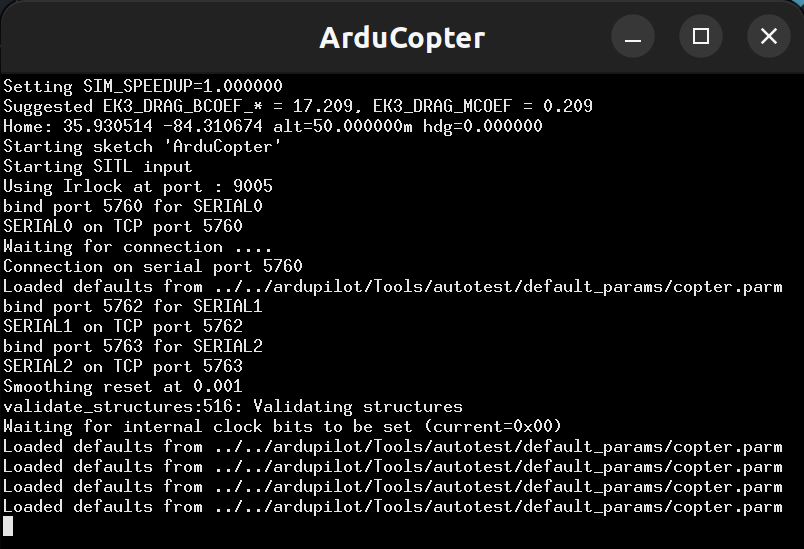
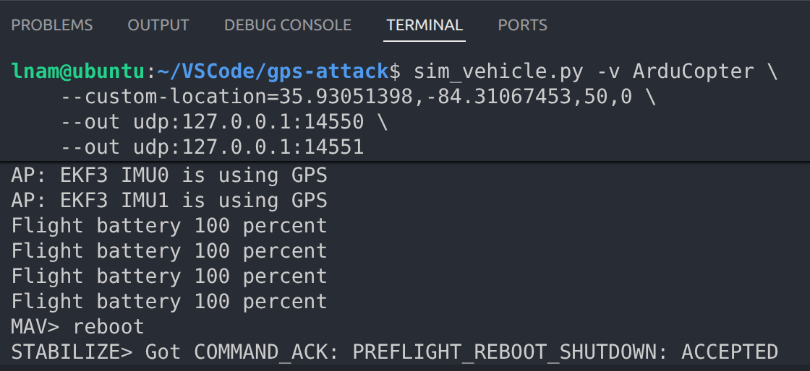

# gps-attack

Replication of Hakani et al., "Evaluation and Telemetry-Based Detection of GPS Spoofing Effects
on UAV Navigation Using Software-Defined Radio," *Scientific Reports*, May 2026.

A drone flies an autonomous waypoint mission in ArduPilot SITL. Mid-flight, a Python hook
injects fake GPS coordinates via MAVLink `GPS_INPUT` messages. The drone deviates, breaches
a geofence, and triggers automatic RTL. Telemetry logs capture anomalies in barometric altitude,
yaw, magnetometer, and HDOP compared to a baseline flight.

---

## Repository layout

```
gps-attack/
├── docker/
│   ├── Dockerfile              Two-stage build: SITL builder → lightweight runtime
│   ├── entrypoint.sh           Starts sim_vehicle.py with env-derived port flags
│   └── docker.env              All tunable Docker values (branch, ports)
├── plans/
│   ├── canberra.plan           QGroundControl waypoint mission + geofence (Canberra, AU)
│   └── ornl.plan               QGroundControl waypoint mission + geofence (ORNL, TN)
├── sim/
│   ├── scenario_params.yaml    Tunable SITL scenario parameter values
│   └── load_scenario.py        Sets ArduPilot scenario parameters via MAVLink
├── attack/
│   └── gps_hook.py             GPS_INPUT injection hook (REPLAY-01)
├── analysis/
│   └── plot_telemetry.py       .bin log extraction + comparison plots (PLOT-01)
├── logs/                       .bin flight logs land here (bind-mounted into container)
├── docker-compose.yml          Single-command container orchestration
├── requirements.txt            Python project dependencies
└── DESIGN_PRACTICES.md
```

---

## Local Installation

Tested on Ubuntu 22.04. All commands run from the repo root unless noted. You only need to run these steps once to c

### Step 1: Clone and build ArduPilot SITL

Clone ArduPilot to `~/ardupilot`, outside this repo so its lifecycle stays independent.

```bash
git clone --branch Copter-4.6.3 --recursive https://github.com/ArduPilot/ardupilot.git ~/ardupilot
cd ~/ardupilot
Tools/environment_install/install-prereqs-ubuntu.sh -y
```

`sim_vehicle.py` and `mavproxy.py` need to be on `PATH`. Rather than scattering exports through `~/.bashrc`, keep them in one dedicated profile and source it from `~/.bashrc`:

```bash
cat > ~/.ardupilot_profile << 'EOF'
# ArduPilot SITL tooling for gps-attack local development.
# sim_vehicle.py lives in the clone; mavproxy.py is pip-installed to ~/.local/bin.
export PATH="$HOME/ardupilot/Tools/autotest:$HOME/.local/bin:$PATH"
EOF

cat >> ~/.bashrc << 'EOF'

if [ -f ~/.ardupilot_profile ]; then
    source ~/.ardupilot_profile
fi
EOF
```

Open a new terminal and verify:

```bash
which sim_vehicle.py
which mavproxy.py
```

### Step 2: Install Python dependencies

From the repo root (not the ardupilot directory):

```bash
pip3 install -r requirements.txt --break-system-packages
```

Dependencies: `pymavlink`, `pyyaml`, `matplotlib`, `numpy`.

### Step 3: Install QGroundControl

Download the latest AppImage from the
[QGroundControl daily builds](https://docs.qgroundcontrol.com/master/en/qgc-user-guide/getting_started/download_and_install.html)
page, then make it executable:

```bash
chmod +x QGroundControl-x86_64.AppImage
./QGroundControl-x86_64.AppImage
```

After opening QGroundControl and verifying that the GUI loads, you can close it for now.

### Removing the local setup

If you no longer need to use or prototype with the `gps-attack` repo, you can remove the local setup by following these instructions.

```bash
rm ~/.ardupilot_profile
```

Then delete this block from the end of `~/.bashrc`:

```bash
if [ -f ~/.ardupilot_profile ]; then
    source ~/.ardupilot_profile
fi
```

---

## Quickstart: `run_simulation.sh`

Once the local setup above is complete, `run_simulation.sh` automates the
manual steps below: it clears persisted SITL state, launches `sim_vehicle.py`
in the background at the chosen preset's location, applies the SITL
parameters for the chosen mode, reboots SITL automatically, and (for attack
modes) runs `attack/gps_hook.py`.

```bash
./run_simulation.sh --mode baseline --preset ornl
./run_simulation.sh --mode static   --preset ornl
./run_simulation.sh --mode dynamic  --preset canberra
```

- `--mode baseline`: clean reference flight (GPS1_TYPE=1, no spoofing).
- `--mode static`: GPS spoofing active immediately (`dynamic_delay_seconds: 0`,
  `dynamic_attack_enabled: false`).
- `--mode dynamic`: GPS spoofing activates `dynamic_delay_seconds` after the
  drone first reaches cruise altitude (not after the script starts), so the
  attack timing is independent of how long mission upload/arming takes.
- `--preset {ornl|canberra}` — selects the SITL location and the matching
  `attack/presets/<preset>.yaml` config and `plans/<preset>.plan` mission.

After the script finishes, open QGroundControl, upload `plans/<preset>.plan`,
and start the mission as described in the steps below — the script does not
automate the QGroundControl GUI. SITL keeps running in the background; the
script prints its PID and log file path so you can stop it afterward.

The sections below walk through what the script automates, step by step, and are encouraged for developers who want to understand the workflow or need to troubleshoot.

---

## AUTO-01: Clean waypoint mission

### Step 1: Start SITL

Open a dedicated terminal in the repo root. `sim_vehicle.py` is an executable installed on your PATH by the prereqs script. Do not prefix it with `python`. SITL binds two MAVLink outputs: UDP 14550 for QGroundControl, UDP 14551 for the Python scripts.

```bash
sim_vehicle.py -v ArduCopter \
    --custom-location=35.93051398,-84.31067453,50,0 \
    --out udp:127.0.0.1:14550 \
    --out udp:127.0.0.1:14551
```

You should see a new `ArduCopter` window pop up.
<p align="center">
    
</p>

**NOTE:** For questions about how ArduPilot formats `custom-location`, see [DEBUG_FAQ.md](DEBUG_FAQ.md#ardupilot-custom-location-formatting).

### Step 2: Apply baseline parameters

In a second terminal:

```bash
python3 sim/load_scenario.py --mode baseline
```

This enables fence behaviour (RTL on breach) via `sim/scenario_params.yaml`. The geofence geometry is defined in the plan file and uploaded later.

### Step 3: Reboot SITL

In the first terminal where you ran `sim_vehicle.py`, type the reboot script.

```bash
reboot
```

<p align="center">
    
</p>

Any time you edit [ArduPilot's GPS parameters](https://ardupilot.org/copter/docs/parameters.html#gps-parameters) (e.g., `GPS1_TYPE`, `GPS_AUTO_SWITCH`), you need to reboot `sim_vehicle.py` for the edits to take place.

### Step 4: Open QGroundControl

If you have not done so already, open QGroundControl (not in Terminal 1).

```bash
./QGroundControl-x86_64.AppImage
```

It auto-connects to SITL on UDP 14550.

### Step 5: Configure QGroundControl.

Inside QGroundControl, use the GUI and apply the following steps:

a.  Go to **Plan** view. (Click the "Q" icon in the top-left corner for the drop-down.)

b.  Click the file icon → **Open** → select `plans/ornl.plan`

c.  Click **Upload** to send the mission and geofence to SITL.

### Step 6: Arm and fly

**CRITICAL STEP**: Wait until the console prints `APM: EKF3 IMU0 is using GPS` before proceeding, because the simulated GPS fix is required for arming. The vehicle spawns near Oak Ridge, TN (35.93°, -84.31°) See [DEBUG_FAQ.md](DEBUG_FAQ.md#ornl-baseline-flight-is-not-ready) if you see a yellow "Not Ready" message.

In QGroundControl **Fly** view, hold the **Start Mission** slider-arm button.


**Expected:** drone takes off to 50m, flies to all waypoints, then RTLs home. No fence breach alert fires.

### Step 7: Retrieve the .bin log

Wait for the flight to finish in QGroundControl.


ArduPilot SITL writes `.bin` DataFlash logs to the `logs/` subdirectory of wherever `sim_vehicle.py` was launched. After landing:

```bash
mkdir -p logs/ornl
ls -lt logs/*.BIN | head -3
cp $(ls -t logs/*.BIN | head -1) logs/ornl/baseline_flight.bin
```

AUTO-01 is complete when `logs/ornl/baseline_flight.bin` exists and the QGroundControl map shows a clean rectangular path with no geofence breach.

---

## STATIC-01: GPS spoofing mid-flight

> **Warning: You should not run this code until AUTO-01 passes.**

Next, we will modify the baseline flight to perform GPS spoofing mid-flight. We will apply the following attack parameters (adds `GPS1_TYPE=14` and `GPS_AUTO_SWITCH=0`) in this ORNL example demo.

### Step 1: Run the SITL

Boot up the SITL using the same script provided in AUTO-01. If you just finished running Step 7 in AUTO-01 (i.e., retrieving the `.bin` files) and have not ended the `sim_vehicle.py` session, then you do not need to run this script again.

```bash
sim_vehicle.py -v ArduCopter \
    --custom-location=35.93051398,-84.31067453,50,0 \
    --out udp:127.0.0.1:14550 \
    --out udp:127.0.0.1:14551
```

An ArduPilot terminal should pop up in a new window if this step succeeded.

### Step 2: Enter GPS spoofing attack mode

In a new terminal, you should run the following script to switch from the `baseline` to `attack` mode.

```bash
python3 sim/load_scenario.py --mode attack
```

By this point, you should have Terminal 1 running `sim_vehicle.py` and Terminal 2 running this `load_scenario.py` file.

### Step 3: Reboot SITL

Type `reboot` in the Terminal 1 (the SITL console).

```bash
reboot
```

### Step 4: Activate the GPS hook attack

Move to Terminal 2 and run the GPS hook:

```bash
python3 attack/gps_hook.py
```

### Step 5: Observe via QGroundControl

Run QGroundControl to observe the GPS spoofing flight. If you have already opened QGroundControl and haven't closed it since AUTO-01, you do not need to re-open it.

```bash
./QGroundControl-x86_64.AppImage
```

### Step 6: Save the spoofed log

Similar to AUTO-01, the spoofed flight has already been saved, but you can rename it for readability.

```bash
ls -lt logs/*.BIN | head -3
cp $(ls -t logs/*.BIN | head -1) logs/ornl/spoofed_flight.bin
```

---

## LOG-01 — Telemetry logging

SITL writes `.bin` logs into the `logs/` directory. Copy both logs under consistent names:

```bash
cp $(ls -t logs/*.BIN | head -1) logs/baseline_flight.bin
cp $(ls -t logs/*.BIN | head -2 | tail -1) logs/spoofed_flight.bin
```

---

## PLOT-01 — Comparison plots

```bash
python3 analysis/plot_telemetry.py \
    logs/baseline_flight.bin \
    logs/spoofed_flight.bin
```

Produces side-by-side plots of barometric altitude, yaw, magnetometer, and HDOP.

---

## Docker setup (optional)

<details>
<summary>Expand for Docker instructions</summary>

> **First build takes 20–30 minutes** while ArduPilot SITL compiles. Subsequent builds
> reuse the cached layer.

### Build and start the container

```bash
docker compose up --build -d
```

SITL starts automatically. Tail its output with:

```bash
docker compose logs -f
```

Wait until you see `APM: EKF3 IMU0 is using GPS`.

### Open QGroundControl on the host

Launch QGroundControl. It auto-connects to SITL via UDP 14550 on localhost.

### Apply parameters

```bash
# Baseline
docker compose exec ardupilot-sitl python3 sim/load_scenario.py --mode baseline

# Attack (after baseline flight completes)
docker compose exec ardupilot-sitl python3 sim/load_scenario.py --mode attack
```

### Run the GPS hook

```bash
docker compose exec ardupilot-sitl python3 attack/gps_hook.py
```

### Retrieve logs

Logs are bind-mounted to `logs/` on the host:

```bash
ls -lt logs/*.BIN | head -3
```

### Stop the container

```bash
docker compose down
```

</details>
